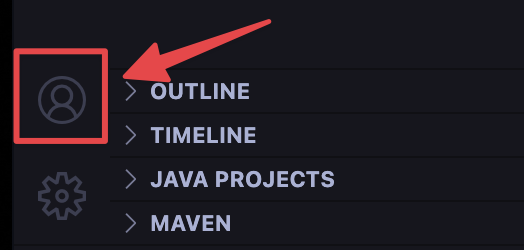

currently housing all survival plugin code - eventually will turn into shared code between survival/creative plugins

# Get started with development

If you're a complete beginner to programming in general, it's highly recommend reading [Getting Started for Dummies](NOOB.md). Otherwise, continuing to read this assumes that you're acclimated to basic programming concepts.

## Install development tools

Make sure you have git and a Java Development Kit (JDK) installed on your computer. You can check by opening a terminal or command prompt and typing these commands:
```sh
git -v
java -version
```
If you see an error, you can [install git](https://www.git-scm.com/downloads) or [the latest JDK](https://www.oracle.com/java/technologies/downloads/) for your platform respectively.

## Set up a local Minecraft server for testing

Our plugin runs using Paper, which is a mod of Minecraft's vanilla server. More specifically, it's a high-performance fork of Bukkit and Spigot. It provides additional optimizations and features that enhance server performance and gameplay experience.

If you don't need to test the plugin, you can skip this section. Otherwise, follow these steps to create a local Paper server:

1. Create a directory somewhere on your computer to store the Minecraft server, like `Documents/Minecraft Servers/regular-place-kit`.
2. Download a Paper server JAR file for the current version of our server, **Minecraft 1.20.2**, from the [PaperMC website](https://papermc.io/downloads/all), and place it in the directory you created earlier.
3. Check out our [scripts directory](scripts/) for scripts to start your Minecraft server. If you're on Windows, copy the `start.bat` file into your server's directory. For macOS and Linux, copy the `start.sh` file.
4. The server will generate necessary configuration files and folders. Once it finishes, stop the server by typing `stop` in the server console.
## fard
```sh
chmod +x start.sh
```

## Pick an IDE for development

To ensure the most streamlined development process, follow the steps below for the IDE of your choice.

### Visual Studio Code

If you haven't already, install [Visual Studio Code](https://code.visualstudio.com/) from Visual Studio's website, and install [GitHub Pull Requests and Issues](https://marketplace.visualstudio.com/items?itemName=GitHub.vscode-pull-request-github) from the marketplace.

Log in to GitHub by clicking on the Accounts button on the bottom left of the window. Follow the instructions.



Make sure you've installed the [Extension Pack for Java](https://marketplace.visualstudio.com/items?itemName=vscjava.vscode-java-pack) from the marketplace. This includes auto completion, refactoring, debugging (hot swapping), and many other useful tools you need for developing in Java.

Now, copy the plugin's code onto your system. To clone this repository in Visual Studio Code, open the Command Palette with `Ctrl` + `Shift` + `P` and search for "Git: Clone". Select "Clone from GitHub", and enter `omg-community/regular-place-kit`.

Select a directory to store this repository in, like `Documents/Code`.


### IntelliJ IDEA

TODO

### Eclipse

Please don't use Eclipse unless you actually genuinely hate yourself and/or don't enjoy life anymore. I have no tips for you if you use Eclipse.

## Good luck!

You're ready to start developing!
